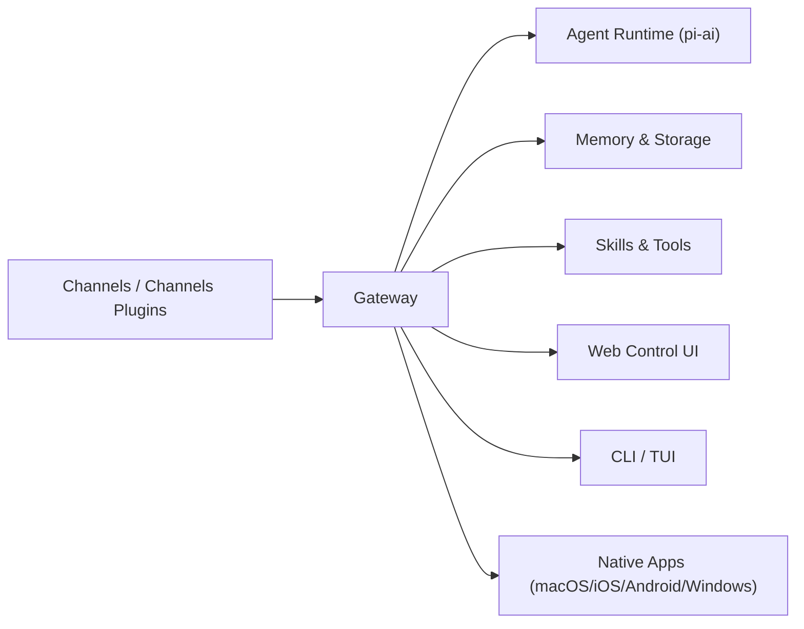

<p align="center">
  
</p>

# OpenSoul

<p align="center">
  <strong>Your AI Soul Companion — Chat, Collaborate, Create</strong><br>
  Self-hosted AI agent gateway across WhatsApp, Telegram, Discord, Slack, iMessage, and 30+ channels.<br>
  运行在你自己的设备或服务器上，一个网关连接多渠道智能体，兼顾隐私与可扩展性。
</p>

<p align="center">
  <a href="https://github.com/NJX-njx/opensoul/actions/workflows/ci.yml"></a>
  <a href="https://github.com/NJX-njx/opensoul/blob/main/LICENSE"></a>
  = 22">
  
  <a href="https://github.com/NJX-njx/opensoul/stargazers"></a>
</p>

<p align="center">
  <a href="#overview--项目简介">Overview</a> •
  <a href="#whats-new--最近迭代亮点">What's New</a> •
  <a href="#features--功能概览">Features</a> •
  <a href="#architecture--架构">Architecture</a> •
  <a href="#tech-stack--技术栈版本">Tech Stack</a> •
  <a href="#performance--性能指标与对比">Performance</a> •
  <a href="#quick-start--快速开始">Quick Start</a> •
  <a href="#usage-examples--使用示例">Examples</a> •
  <a href="#documentation--文档">Docs</a> •
  <a href="#contributing--贡献">Contributing</a>
</p>

---

## Overview / 项目简介

OpenSoul 是一个 **自托管 AI 智能体网关**。你只需要运行一个 Gateway，就可以在 WhatsApp、Telegram、Discord、Slack、iMessage 等 30+ 渠道里与同一个 AI 伴侣对话，并拥有会话隔离、长期记忆、工具调用、插件扩展等完整能力。

It is a **local-first control plane**: one Gateway bridges your chat apps and your AI agent runtime, giving you full control over data, routing, and tools while supporting multiple providers and models.

## What's New / 最近迭代亮点

基于最新变更记录（见 [CHANGELOG](CHANGELOG.md)）：

- Onboarding 与 Control UI 国际化覆盖更广，体验更一致。
- Windows 桌面端交互与布局细节优化，连接稳定性提升。
- 网关连接与健康检查逻辑加强，桌面端重连更可靠。
- 扩展插件版本与核心版本同步，发布节奏统一。

## Features / 功能概览

### 🌐 30+ Channels

| Category      | Channels                                                             |
| ------------- | -------------------------------------------------------------------- |
| Messaging     | WhatsApp · Telegram · Signal · iMessage · Matrix · Mattermost · Zalo |
| Collaboration | Slack · Discord · Microsoft Teams · Lark (Feishu) · LINE             |
| Web + API     | Web Control UI · WebChat · REST API · WebSocket                      |
| Voice + Media | Voice Call · Audio · Images · Documents                              |

### 🧠 Agent Core

- Multi-model routing (OpenAI, Anthropic, Gemini, Bedrock, Ollama, MiniMax, OpenRouter, and more)
- Multi-agent session isolation per sender/workspace
- Long-term memory with vector search
- Tool execution, sandboxing, and plugin-based extensions

### 🛠️ Skills & Tools

- 50+ built-in skills under [skills/](skills/)
- GitHub, Notion, Obsidian, Canvas, tmux, browser automation, and more
- Extensible plugin SDK for custom skills

### 📱 Cross-Platform Apps

- macOS, iOS, Android, Windows native apps
- Web Control UI + CLI/TUI for power users

## Architecture / 架构



### Core Modules / 核心模块说明

| Module        | Path                    | Description                                            |
| ------------- | ----------------------- | ------------------------------------------------------ |
| Gateway       | src/gateway             | 网关进程：连接渠道、路由会话、暴露 WebSocket/HTTP 接口 |
| Agent Runtime | src/agents              | 智能体运行时与路由、会话与工具注入                     |
| Channels      | src/\*_/ + extensions/_ | 各渠道集成与协议适配                                   |
| Skills        | skills/                 | 内置技能与插件式能力                                   |
| Memory        | src/memory              | 长期记忆与存储管理                                     |
| Web UI        | ui/                     | Web 控制台与交互界面                                   |
| Apps          | apps/                   | 原生跨平台应用                                         |

## Tech Stack / 技术栈版本

| Layer         | Version                      |
| ------------- | ---------------------------- |
| Node.js       | >= 22.12.0                   |
| pnpm          | 10.23.0                      |
| TypeScript    | 5.9.3                        |
| Web UI        | Lit 3.3.2 + Vite             |
| API Server    | Hono 4.11.10 / Express 5.2.1 |
| Testing       | Vitest 4.0.18                |
| Lint / Format | Oxlint 1.43.0 + Oxfmt 0.28.0 |

## Performance / 性能指标与对比

模型延迟基准数据来自 [docs/reference/test.md](docs/reference/test.md)（本地密钥，2025-12-31，20 次运行）：

| Model       | Median  | Min     | Max     |
| ----------- | ------- | ------- | ------- |
| MiniMax     | 1279 ms | 1114 ms | 2431 ms |
| Claude Opus | 2454 ms | 1224 ms | 3170 ms |

说明：同一脚本、相同提示词下的端到端响应延迟对比，用于粗粒度评估模型服务可用性与稳定性。

## Quick Start / 快速开始

### Prerequisites

- Node.js >= 22
- pnpm

### One-Click Install Script / 一键安装脚本

Docker 方式快速启动（含交互式引导）：

```bash
bash docker-setup.sh
```

### Local Install / 本地安装

```bash
git clone https://github.com/NJX-njx/opensoul.git
cd opensoul
pnpm install
pnpm build
```

**Start the Gateway** (required for Web Control UI and channels):

```bash
# Dev mode (skips channels that need external API credentials; port 19001)
export OPENSOUL_SKIP_CHANNELS=1
export OPENSOUL_GATEWAY_TOKEN=dev-token   # Required — Gateway exits without it
pnpm gateway:dev
```

Or for production (after `opensoul onboard`):

```bash
opensoul gateway run
```

**Windows users**: The `gateway:dev` script uses Unix-style env syntax. Use WSL, or run:

```powershell
$env:OPENSOUL_SKIP_CHANNELS = "1"; $env:OPENSOUL_GATEWAY_TOKEN = "dev-token"; node scripts/run-node.mjs --dev gateway
```

### Environment Template / 环境变量模板

以下模板适用于常见模型与网关鉴权（可放入 `.env` 或 `~/.opensoul/.env`）：

```bash
OPENAI_API_KEY=
ANTHROPIC_API_KEY=
OPENROUTER_API_KEY=
GEMINI_API_KEY=
MINIMAX_API_KEY=
OPENCODE_API_KEY=
ZAI_API_KEY=
OPENSOUL_GATEWAY_TOKEN=    # Required for Gateway to start
```

环境变量加载顺序与说明请见 [Environment](docs/help/environment.md)。

### Common Troubleshooting / 常见问题排查

| Symptom                        | Cause                           | Fix                                                   |
| ------------------------------ | ------------------------------- | ----------------------------------------------------- |
| Gateway 启动后立即退出         | 未设置 `OPENSOUL_GATEWAY_TOKEN` | 设置环境变量或 `gateway.auth.token`，参见上方启动说明 |
| Gateway 启动失败且提示端口占用 | 18789 端口被占用                | 更换 `gateway.port` 或使用 `pnpm test:force` 清理残留 |
| 服务模式下 API key 失效        | 守护进程未继承 shell 环境       | 将密钥放入 `~/.opensoul/.env` 或启用 `env.shellEnv`   |
| 控制台无法访问                 | Token 未配置或未放行            | 设置 `gateway.auth.token` 并使用正确的 token          |

## Usage Examples / 使用示例

### CLI Onboarding

```bash
opensoul onboard
```

### Launch Web Control UI

```bash
opensoul dashboard
```

### Add a Channel (Telegram)

```bash
opensoul channels add --channel telegram --token <bot_token>
```

## Documentation / 文档

- [Getting Started](docs/start/)
- [Gateway Configuration](docs/gateway/configuration.md)
- [Channels](docs/channels/)
- [Skills & Tools](docs/tools/)
- [Model Providers](docs/concepts/model-providers.md)
- [Web Control UI](docs/web/control-ui.md)

## API Reference / API 接口

- [Gateway RPC](docs/reference/rpc.md)
- [Reference Index](docs/reference/)

## Contributing / 贡献

- [Contributing Guide](CONTRIBUTING.md)
- [Code of Conduct](CODE_OF_CONDUCT.md)
- Maintainer: [NJX-njx](https://github.com/NJX-njx)
- Contributors: [GitHub Contributors](https://github.com/NJX-njx/opensoul/graphs/contributors)

## License / 许可证

[MIT License](LICENSE) — see [LICENSE](LICENSE) for details. Built upon [OpenClaw](https://github.com/nicepkg/openclaw) (MIT).

---

<p align="center">
  如果你觉得 OpenSoul 对你有帮助，请在 GitHub 上给我们点亮 ⭐！
</p>
