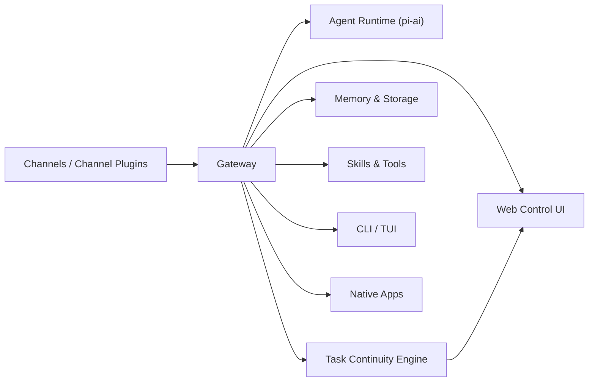

<p align="center">
  
</p>

<p align="center">
  <strong>One agent, many surfaces, one continuous task life.</strong><br>
  Self-hosted AI agent runtime for cross-surface task continuity across chat apps, Control UI, Canvas, cron, and paired devices.<br>
  Start in a DM, hand off into the browser, keep commitments and event history visible, and let the same task continue running.
</p>

<p align="center">
  <a href="https://github.com/NJX-njx/opensoul/actions/workflows/ci.yml"></a>
  <a href="https://github.com/NJX-njx/opensoul/blob/main/LICENSE"></a>
  = 22">
  
  <a href="https://github.com/NJX-njx/opensoul/stargazers"></a>
</p>

<p align="center">
  <a href="#overview">Overview</a> •
  <a href="#whats-new">What's New</a> •
  <a href="#quick-start">Quick Start</a> •
  <a href="#configuration">Configuration</a> •
  <a href="#developer-workflow">Developer Workflow</a> •
  <a href="#architecture">Architecture</a> •
  <a href="#troubleshooting">Troubleshooting</a> •
  <a href="#docs">Docs</a>
</p>

---

## Overview

OpenSoul is a **self-hosted AI agent runtime for cross-surface task continuity**. It does more than mirror the same bot into many channels: one agent can start in WhatsApp, Telegram, Discord, Slack, or the Control UI, then keep the same task alive as work moves into Canvas, cron, subagents, and follow-up sessions.

It is a **local-first control plane**: channel adapters, task continuity state, model routing, memory, tools, and security boundaries all live in one runtime that you control. The project includes the gateway, Web Control UI, CLI/TUI workflows, and native clients.

## What's New

Based on recent updates in [CHANGELOG](CHANGELOG.md):

### Latest product direction (2026-03-12)

- **Cross-surface task continuity**: introduced operational task state (`tasks`, task events, commitments) so one agent can keep the same work alive across direct chat, Control UI, Canvas, cron, and subagents.
- **System-driven handoff**: direct-chat work can now be handed off into a deep-linked Control UI session, with Canvas opening that same session context instead of branching into a separate workflow.
- **Visible continuity UI**: the Control UI chat page now exposes a right rail with task status, commitments, event timeline, and surface handoff track, so the feature is visible instead of purely architectural.
- **Read-only task APIs**: clients can inspect continuity state through `tasks.list`, `tasks.get`, `tasks.events`, and `tasks.commitments`.

### Recent release highlights (0.2.4)

- Session transcript loading in the Control UI.
- Create Soulmate modal and better workspace management flows.
- More reliable WebSocket reconnect behavior after connection drops.
- Better onboarding flows, MiniMax support, and CLI developer defaults.

## Quick Start

### Prerequisites

- Node.js >= 22.12.0
- pnpm >= 10

### Install from source

```bash
git clone https://github.com/NJX-njx/opensoul.git
cd opensoul
pnpm install
pnpm build
```

### Configure for local development

```bash
# macOS / Linux
export OPENSOUL_SKIP_CHANNELS=1
export OPENSOUL_GATEWAY_TOKEN=dev-token
# Optional: set at least one model provider key
export OPENAI_API_KEY=your-api-key
```

### Start locally

```bash
pnpm gateway:dev
```

### Start locally on Windows (PowerShell)

```powershell
$env:OPENSOUL_SKIP_CHANNELS = "1"
$env:OPENSOUL_GATEWAY_TOKEN = "dev-token"
$env:OPENAI_API_KEY = "your-api-key"
node scripts/run-node.mjs --dev gateway
```

### See the flagship experience

After `pnpm gateway:dev`, open `http://127.0.0.1:19001/` and use the Chat page. When a conversation turns into a real task, the right rail shows:

- current task status
- commitments and follow-ups
- event timeline
- surface handoff trail across direct chat, Control UI, Canvas, cron, and subagents

### Install and run via CLI

```bash
npm install -g opensoul@latest
opensoul onboard
opensoul gateway run
```

For model keys and provider setup, see the [Model Setup Guide](docs/guides/model-setup.md). For end-to-end deploy steps, see the [Beginner Deployment Guide](docs/start/deployment-beginner.md).

## Configuration

Put shared settings in `.env` or `~/.opensoul/.env`:

```bash
OPENAI_API_KEY=
ANTHROPIC_API_KEY=
OPENROUTER_API_KEY=
GEMINI_API_KEY=
MINIMAX_API_KEY=
OPENSOUL_GATEWAY_TOKEN=
```

- `OPENSOUL_GATEWAY_TOKEN` (or `gateway.auth.token`) is required for gateway startup.
- Use `OPENSOUL_SKIP_CHANNELS=1` for local development unless channel credentials are already configured.
- Config supports JSON5, includes, and `${ENV}` substitution. See [Environment](docs/help/environment.md).

## Developer Workflow

```bash
pnpm install
pnpm build
pnpm dev
pnpm gateway:dev
pnpm check
pnpm test
```

- After changing `ui/`, run `pnpm ui:build` and restart the gateway.
- `pnpm check` runs type-check, lint, and format checks.
- `pnpm check:loc` uses repository limits: `--max 2000 --max-function 150`.

## Architecture


```mermaid
flowchart LR
  A["Channels / Channel Plugins"] --> B["Gateway"]
  B --> C["Agent Runtime (pi-ai)"]
  B --> D["Task Continuity Engine"]
  B --> E["Memory & Storage"]
  B --> F["Skills & Tools"]
  B --> G["Web Control UI"]
  D --> G
  B --> H["CLI / TUI"]
  B --> I["Native Apps"]
```

### Core modules

| Module             | Path                                   | Responsibility                                          |
| ------------------ | -------------------------------------- | ------------------------------------------------------- |
| Gateway            | `src/gateway`                          | HTTP/WS server, orchestration, sidecars                 |
| Agent Runtime      | `src/agents`                           | Session execution, tool injection, runtime integration  |
| Task Continuity    | `src/continuity`                       | Tasks, commitments, task events, handoff policy         |
| Routing            | `src/routing`                          | Message-to-agent/session resolution                     |
| Plugins & Channels | `src/plugins`, `src/_`, `extensions/_` | Plugin loading, channel adapters, protocol integrations |
| Memory             | `src/memory`                           | Long-term memory and storage                            |
| UI & Apps          | `ui/`, `apps/`                         | Web Control UI, continuity rail, and native clients     |

### Repository layout

```text
src/           Core gateway, runtime, routing, config, plugins
src/continuity Operational task state, events, commitments, handoff policy
extensions/    External channel/provider/hook plugins
ui/            Web Control UI assets and app
skills/        Built-in skills
docs/          User and reference documentation
apps/          Native clients
scripts/       Build, release, test, and tooling scripts
```

### Tech stack

- Runtime: Node.js 22+, TypeScript 5.9, pnpm 10
- Web UI: Lit 3 + Vite
- API: Hono + Express
- Testing and quality: Vitest, Oxlint, Oxfmt

## Testing

- Main entry: `pnpm test`
- Additional configs: `vitest.config.ts`, `vitest.e2e.config.ts`, `vitest.gateway.config.ts`, `vitest.extensions.config.ts`, `vitest.live.config.ts`
- Docker and e2e suites live under `scripts/e2e/` and `test:docker:*`

## Extension Development

- Place extensions under `extensions/<name>/`
- Use `opensoul/plugin-sdk` as the public API surface
- Do not import internal `src/*` modules from external extensions
- Typical packages include `opensoul.plugin.json` and `index.ts`

## Troubleshooting

| Symptom                               | Likely Cause                         | Fix                                                     |
| ------------------------------------- | ------------------------------------ | ------------------------------------------------------- |
| Gateway exits immediately             | Missing gateway token                | Set `OPENSOUL_GATEWAY_TOKEN` or `gateway.auth.token`    |
| Gateway dev fails on channel startup  | Missing external channel credentials | Use `OPENSOUL_SKIP_CHANNELS=1` for local dev            |
| Port conflict                         | Port already in use                  | Change `gateway.port` or run `pnpm test:force` cleanup  |
| API keys not available in service run | Shell env not inherited              | Put keys in `~/.opensoul/.env` or enable `env.shellEnv` |

## Docs

- [Getting Started](docs/start/)
- [Model Setup Guide](docs/guides/model-setup.md)
- [Beginner Deployment Guide](docs/start/deployment-beginner.md)
- [Gateway Configuration](docs/gateway/configuration.md)
- [Channels](docs/channels/)
- [Skills & Tools](docs/tools/)
- [Reference Index](docs/reference/)
- [Project Wiki](https://github.com/NJX-njx/opensoul/wiki)

## Contributing

- [Contributing Guide](CONTRIBUTING.md)
- [Code of Conduct](CODE_OF_CONDUCT.md)
- Maintainer: [NJX-njx](https://github.com/NJX-njx)
- Contributors: [GitHub Contributors](https://github.com/NJX-njx/opensoul/graphs/contributors)

## License

[MIT License](LICENSE) — see [LICENSE](LICENSE) for details. Built upon [OpenClaw](https://github.com/nicepkg/openclaw) (MIT).

---

<p align="center">
  If OpenSoul helps you, please consider giving the project a ⭐ on GitHub.
</p>
