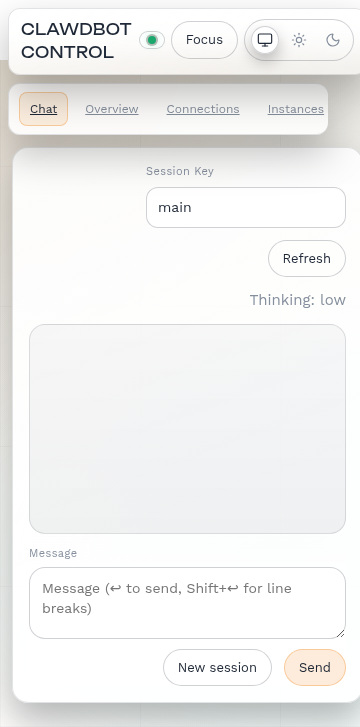
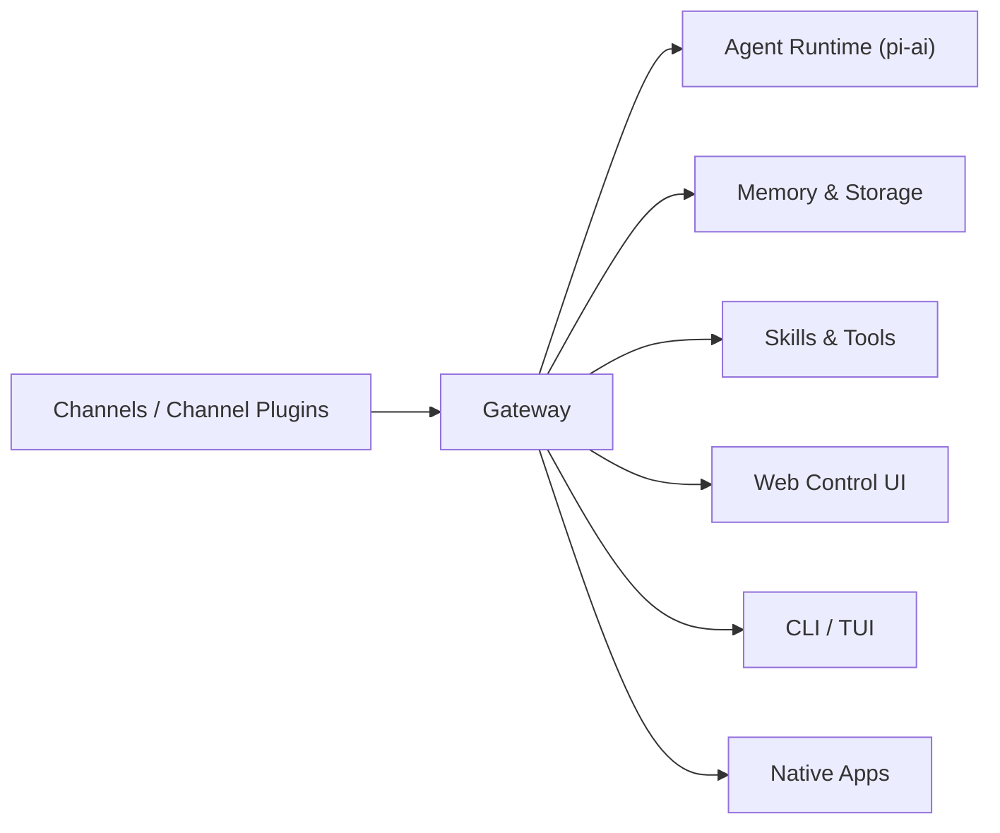

<p align="center">
  
</p>

<p align="center">
  <strong>Your AI Soul Companion — Chat, Collaborate, Create</strong><br>
  Self-hosted AI agent gateway across WhatsApp, Telegram, Discord, Slack, iMessage, and 30+ channels.<br>
  One gateway, multiple channels, full control over data, routing, and extensibility.
</p>

<p align="center">
  <a href="https://github.com/NJX-njx/opensoul/actions/workflows/ci.yml"></a>
  <a href="https://github.com/NJX-njx/opensoul/blob/main/LICENSE"></a>
  = 22">
  
  <a href="https://github.com/NJX-njx/opensoul/stargazers"></a>
</p>

<p align="center">
  <a href="#overview">Overview</a> •
  <a href="#whats-new">What's New</a> •
  <a href="#features">Features</a> •
  <a href="#architecture">Architecture</a> •
  <a href="#repository-layout">Repository Layout</a> •
  <a href="#tech-stack">Tech Stack</a> •
  <a href="#quick-start">Quick Start</a> •
  <a href="#configuration">Configuration</a> •
  <a href="#developer-workflow">Developer Workflow</a> •
  <a href="#testing">Testing</a> •
  <a href="#extension-development">Extensions</a> •
  <a href="#troubleshooting">Troubleshooting</a> •
  <a href="#documentation">Docs</a> •
  <a href="ROADMAP.md">Roadmap</a>
</p>

---

## Overview

OpenSoul is a **self-hosted AI agent gateway**. Run one gateway process and talk to the same agent across WhatsApp, Telegram, Discord, Slack, iMessage, and many more channels.

It is a **local-first control plane**: channel adapters connect into one runtime where you control model routing, memory, tools, and security boundaries.

## Product Preview

<p align="center">
  
</p>

## What's New (v0.2.4)

Based on recent updates in [CHANGELOG](CHANGELOG.md):

- **Session transcripts**: load and review past conversation history directly from the Control UI.
- **Create Soulmate modal**: streamlined agent creation workflow in the Control UI.
- **Gateway reconnect**: automatic WebSocket reconnection after connection drops.
- **Onboarding improvements**: better MiniMax support, empty-response error visibility, and localized config forms.
- **Developer experience**: enhanced CLI dev defaults, GitHub workflow validation, and repo cleanup.
- **Windows desktop client**: native installer with system proxy detection (v0.2.3).

### Latest Maintenance Updates (post-v0.2.4)

- **Security hardening**: WebSocket connection limits, ping/pong keepalive, and slow-consumer handling.
- **Data safety**: durable transcript writes with fsync and write-lock protection.
- **Runtime stability**: concurrency-safe embedded runner CWD handling and plugin runtime auto-disable after repeated failures.
- **Repository hygiene**: removed committed secret test files and tracked release bundles; added pre-commit secret/bundle guards.
- **Docs & onboarding**: beginner deployment guide, Create Soulmate guide, and improved actionable error messaging.
- **CLI & packaging audit**: published to public npm, Node version preinstall check, env var help docs, `--deliver` deprecation, lazy subcommand caching, gateway error unification, plugin shortname resolution.
- **Install improvements**: platform-specific native dependency docs, re-enabled install-smoke CI, simplified npm/pnpm install instructions.
- **CI & installer reliability**: pinned install-smoke to Node 22, standardized public installer URLs on `opensoul.ai`, and added retry/timeout handling for Docker smoke coverage.
- **Release validation**: release and contributor docs now call out `pnpm github:validate`, `pnpm protocol:check`, and install smoke coverage when workflows, protocol models, or installer paths change.

## Features

### 🌐 30+ Channels

| Category      | Channels                                                             |
| ------------- | -------------------------------------------------------------------- |
| Messaging     | WhatsApp · Telegram · Signal · iMessage · Matrix · Mattermost · Zalo |
| Collaboration | Slack · Discord · Microsoft Teams · Lark (Feishu) · LINE             |
| Web + API     | Web Control UI · WebChat · REST API · WebSocket                      |
| Voice + Media | Voice Call · Audio · Images · Documents                              |

### 🧠 Agent Runtime

- Multi-model routing (OpenAI, Anthropic, Gemini, Bedrock, Ollama, MiniMax, OpenRouter, and more)
- Session isolation by sender/workspace
- Long-term memory with vector search
- Tool execution, sandboxing, and plugin-driven extensibility

### 🛠️ Skills & Tools

- 50+ built-in skills in [skills/](skills/)
- Integrations for GitHub, Notion, Obsidian, Canvas, tmux, browser automation, and more
- Public plugin SDK for custom channels, tools, hooks, and providers

### 📱 Cross-Platform Clients

- Native apps for macOS, iOS, Android, and Windows
- Web Control UI plus CLI/TUI workflows
- See the [Client Release-Readiness Matrix](docs/platforms/client-release-readiness.md) for per-platform availability, install routes, and known blockers

## Architecture


```mermaid
flowchart LR
  A["Channels / Channel Plugins"] --> B["Gateway"]
  B --> C["Agent Runtime (pi-ai)"]
  B --> D["Memory & Storage"]
  B --> E["Skills & Tools"]
  B --> F["Web Control UI"]
  B --> G["CLI / TUI"]
  B --> H["Native Apps"]
```

### Core Modules

| Module        | Path                 | Responsibility                                         |
| ------------- | -------------------- | ------------------------------------------------------ |
| Gateway       | src/gateway          | HTTP/WS server, orchestration, sidecars                |
| Agent Runtime | src/agents           | Session execution, tool injection, runtime integration |
| Routing       | src/routing          | Message-to-agent/session resolution                    |
| Plugins       | src/plugins          | Discovery, loading, registry, runtime API              |
| Channels      | src/_ + extensions/_ | Channel adapters and protocol integration              |
| Memory        | src/memory           | Long-term memory and storage                           |
| Web UI        | ui/                  | Control UI (Lit + Vite)                                |
| Apps          | apps/                | Native mobile/desktop clients                          |

## Repository Layout

```text
src/           Core gateway, agent runtime, routing, config, plugins
extensions/    External channel/provider/hook plugins
ui/            Web Control UI assets and app
skills/        Built-in skills
docs/          User and reference documentation
apps/          Native clients (Android/iOS/macOS/Windows)
scripts/       Build, release, test, and tooling scripts
```

## Tech Stack

| Layer         | Version                      |
| ------------- | ---------------------------- |
| Node.js       | >= 22.12.0                   |
| pnpm          | 10.23.0                      |
| TypeScript    | 5.9.3                        |
| Web UI        | Lit 3.3.2 + Vite             |
| API Server    | Hono 4.11.10 / Express 5.2.1 |
| Testing       | Vitest 4.0.18                |
| Lint / Format | Oxlint 1.43.0 + Oxfmt 0.28.0 |

## Quick Start

### Prerequisites

- Node.js >= 22
- pnpm

### Install

**Via npm (recommended):**

```bash
npm install -g opensoul@latest
opensoul onboard --install-daemon
```

**From source:**

```bash
git clone https://github.com/NJX-njx/opensoul.git
cd opensoul
pnpm install
pnpm build
```

### Start Gateway (Dev)

```bash
# Skips channels that require external credentials
export OPENSOUL_SKIP_CHANNELS=1
export OPENSOUL_GATEWAY_TOKEN=dev-token
pnpm gateway:dev
```

### Start Gateway on Windows (PowerShell)

```powershell
$env:OPENSOUL_SKIP_CHANNELS = "1"; $env:OPENSOUL_GATEWAY_TOKEN = "dev-token"; node scripts/run-node.mjs --dev gateway
```

### Production Runtime

```bash
opensoul onboard
opensoul gateway run
```

> **Model setup:** see the [Model Setup Guide](docs/guides/model-setup.md) for API key, OAuth,
> and local Ollama paths — including minimal config snippets, verification commands, and
> common failure fixes.

> **Beginner deployment path:** see the [Beginner Deployment Guide](docs/start/deployment-beginner.md)
> for Windows/macOS/Linux commands, post-deploy checks, and rollback/uninstall paths.

## Configuration

### Environment Template

You can place these in `.env` or `~/.opensoul/.env`:

```bash
OPENAI_API_KEY=
ANTHROPIC_API_KEY=
OPENROUTER_API_KEY=
GEMINI_API_KEY=
MINIMAX_API_KEY=
OPENCODE_API_KEY=
ZAI_API_KEY=
OPENSOUL_GATEWAY_TOKEN=
```

See [Environment](docs/help/environment.md) for loading order and precedence.

### Key Notes

- `OPENSOUL_GATEWAY_TOKEN` (or `gateway.auth.token`) is required for gateway startup.
- Prefer `OPENSOUL_SKIP_CHANNELS=1` for local development unless channel credentials are configured.
- Config supports JSON5, includes, and `${ENV}` substitution.

## Developer Workflow

### Core Commands

```bash
pnpm install
pnpm build
pnpm dev
pnpm gateway:dev
pnpm check
pnpm test
```

### UI Workflow

After changing `ui/`:

1. Run `pnpm ui:build`
2. Restart gateway to refresh served control UI assets

### Quality Gate

- `pnpm check` = type-check + lint + format-check
- `pnpm check:loc` uses repository limits: `--max 2000 --max-function 150`

## Testing

- Main test entry: `pnpm test`
- Config variants: `vitest.config.ts`, `vitest.e2e.config.ts`, `vitest.gateway.config.ts`, `vitest.extensions.config.ts`, `vitest.live.config.ts`
- Docker/e2e suites are available under `scripts/e2e/` and `test:docker:*` scripts

## Extension Development

- Place extensions under `extensions/<name>/`
- Use `opensoul/plugin-sdk` as the public API surface
- Do not import internal `src/*` modules from external extensions
- Typical extension package includes `opensoul.plugin.json` and `index.ts`

## Troubleshooting

| Symptom                               | Likely Cause                         | Fix                                                     |
| ------------------------------------- | ------------------------------------ | ------------------------------------------------------- |
| Gateway exits immediately             | Missing gateway token                | Set `OPENSOUL_GATEWAY_TOKEN` or `gateway.auth.token`    |
| Gateway dev fails on channel startup  | Missing external channel credentials | Use `OPENSOUL_SKIP_CHANNELS=1` for local dev            |
| Port conflict                         | Port already in use                  | Change `gateway.port` or run `pnpm test:force` cleanup  |
| API keys not available in service run | Shell env not inherited              | Put keys in `~/.opensoul/.env` or enable `env.shellEnv` |

## Documentation

- [**Wiki**](https://github.com/NJX-njx/opensoul/wiki) — Comprehensive project knowledge base
- [Getting Started](docs/start/)
- [**Model Setup Guide**](docs/guides/model-setup.md) — API key / OAuth / local Ollama setup with verification commands
- [Create Soulmate Guide](docs/guides/create-soulmate.md) — creation flow, constraints, failure recovery, and post-create checks
- [Gateway Configuration](docs/gateway/configuration.md)
- [Channels](docs/channels/)
- [Skills & Tools](docs/tools/)
- [Model Providers](docs/concepts/model-providers.md)
- [Web Control UI](docs/web/control-ui.md)
- [Client Release-Readiness Matrix](docs/platforms/client-release-readiness.md) — per-platform availability, install routes, and known blockers
- [Platforms](docs/platforms/index.md)

## API Reference

- [Gateway RPC](docs/reference/rpc.md)
- [Reference Index](docs/reference/)

## Roadmap

See [ROADMAP.md](ROADMAP.md) for planned features, current priorities, and shipped milestones.

## Contributing

- [Contributing Guide](CONTRIBUTING.md)
- [Code of Conduct](CODE_OF_CONDUCT.md)
- Maintainer: [NJX-njx](https://github.com/NJX-njx)
- Contributors: [GitHub Contributors](https://github.com/NJX-njx/opensoul/graphs/contributors)

## License

[MIT License](LICENSE) — see [LICENSE](LICENSE) for details. Built upon [OpenClaw](https://github.com/nicepkg/openclaw) (MIT).

---

<p align="center">
  If OpenSoul helps you, please consider giving the project a ⭐ on GitHub.
</p>
