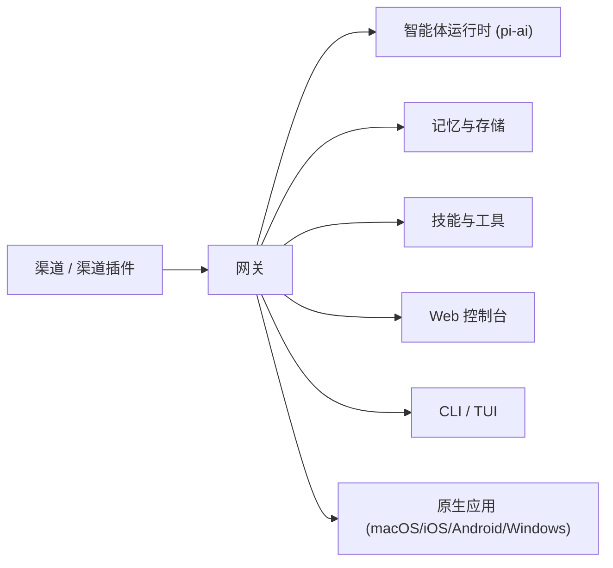

<p align="center">
  
</p>

# OpenSoul

<p align="center">
  <strong>你的 AI 灵魂伴侣 — 聊天、协作、创造</strong><br>
  自托管 AI 智能体网关，支持 WhatsApp、Telegram、Discord、Slack、iMessage 等 30+ 渠道。<br>
  运行在你自己的设备或服务器上，一个网关连接多渠道智能体，兼顾隐私与可扩展性。
</p>

<p align="center">
  <a href="https://github.com/NJX-njx/opensoul/actions/workflows/ci.yml"></a>
  <a href="https://github.com/NJX-njx/opensoul/blob/main/LICENSE"></a>
  = 22">
  
  <a href="https://github.com/NJX-njx/opensoul/stargazers"></a>
</p>

<p align="center">
  <a href="#项目简介">项目简介</a> •
  <a href="#最近迭代亮点">最近迭代</a> •
  <a href="#功能概览">功能概览</a> •
  <a href="#架构">架构</a> •
  <a href="#技术栈版本">技术栈</a> •
  <a href="#性能指标与对比">性能</a> •
  <a href="#快速开始">快速开始</a> •
  <a href="#使用示例">使用示例</a> •
  <a href="#文档">文档</a> •
  <a href="#贡献">贡献</a>
</p>

---

## 项目简介

OpenSoul 是一个 **自托管 AI 智能体网关**。你只需要运行一个 Gateway，就可以在 WhatsApp、Telegram、Discord、Slack、iMessage 等 30+ 渠道里与同一个 AI 伴侣对话，并拥有会话隔离、长期记忆、工具调用、插件扩展等完整能力。

采用 **本地优先的控制平面**：一个网关连接你的聊天应用与 AI 智能体运行时，让你完全掌控数据、路由与工具，同时支持多种模型提供商。

## 最近迭代亮点

基于最新变更记录（见 [CHANGELOG](CHANGELOG.md)）：

- Onboarding 与 Control UI 国际化覆盖更广，体验更一致。
- Windows 桌面端交互与布局细节优化，连接稳定性提升。
- 网关连接与健康检查逻辑加强，桌面端重连更可靠。
- 扩展插件版本与核心版本同步，发布节奏统一。

## 功能概览

### 🌐 30+ 渠道

| 类别       | 渠道                                                                 |
| ---------- | -------------------------------------------------------------------- |
| 即时通讯   | WhatsApp · Telegram · Signal · iMessage · Matrix · Mattermost · Zalo |
| 协作平台   | Slack · Discord · Microsoft Teams · 飞书 (Lark) · LINE               |
| Web + API  | Web 控制台 · WebChat · REST API · WebSocket                          |
| 语音与媒体 | 语音通话 · 音频 · 图片 · 文档                                        |

### 🧠 智能体核心

- 多模型路由（OpenAI、Anthropic、Gemini、Bedrock、Ollama、MiniMax、OpenRouter 等）
- 按发送者/工作区隔离的多智能体会话
- 基于向量搜索的长期记忆
- 工具执行、沙箱与基于插件的扩展

### 🛠️ 技能与工具

- [skills/](skills/) 目录下 50+ 内置技能
- GitHub、Notion、Obsidian、Canvas、tmux、浏览器自动化等
- 可扩展插件 SDK，支持自定义技能

### 📱 跨平台应用

- macOS、iOS、Android、Windows 原生应用
- Web 控制台 + CLI/TUI 供高级用户使用

## 架构



### 核心模块说明

| 模块          | 路径                    | 说明                                              |
| ------------- | ----------------------- | ------------------------------------------------- |
| Gateway       | src/gateway             | 网关进程：连接渠道、路由会话、暴露 WebSocket/HTTP |
| Agent Runtime | src/agents              | 智能体运行时与路由、会话与工具注入                |
| Channels      | src/\*_/ + extensions/_ | 各渠道集成与协议适配                              |
| Skills        | skills/                 | 内置技能与插件式能力                              |
| Memory        | src/memory              | 长期记忆与存储管理                                |
| Web UI        | ui/                     | Web 控制台与交互界面                              |
| Apps          | apps/                   | 原生跨平台应用                                    |

## 技术栈版本

| 层级        | 版本                         |
| ----------- | ---------------------------- |
| Node.js     | >= 22.12.0                   |
| pnpm        | 10.23.0                      |
| TypeScript  | 5.9.3                        |
| Web UI      | Lit 3.3.2 + Vite             |
| API Server  | Hono 4.11.10 / Express 5.2.1 |
| Testing     | Vitest 4.0.18                |
| Lint/Format | Oxlint 1.43.0 + Oxfmt 0.28.0 |

## 性能指标与对比

模型延迟基准数据来自 [docs/reference/test.md](docs/reference/test.md)（本地密钥，2025-12-31，20 次运行）：

| 模型        | 中位数  | 最小值  | 最大值  |
| ----------- | ------- | ------- | ------- |
| MiniMax     | 1279 ms | 1114 ms | 2431 ms |
| Claude Opus | 2454 ms | 1224 ms | 3170 ms |

说明：同一脚本、相同提示词下的端到端响应延迟对比，用于粗粒度评估模型服务可用性与稳定性。

## 快速开始

### 前置要求

- Node.js >= 22
- pnpm

### 一键安装脚本

Docker 方式快速启动（含交互式引导）：

```bash
bash docker-setup.sh
```

### 本地安装

```bash
git clone https://github.com/NJX-njx/opensoul.git
cd opensoul
pnpm install
pnpm build
```

**启动 Gateway**（Web 控制台与渠道均依赖此服务）：

```bash
# 开发模式（跳过需外部 API 凭证的渠道；端口 19001）
export OPENSOUL_SKIP_CHANNELS=1
export OPENSOUL_GATEWAY_TOKEN=dev-token   # 必填，否则 Gateway 无法启动
pnpm gateway:dev
```

或生产模式（需先执行 `opensoul onboard` 完成配置）：

```bash
opensoul gateway run
```

**Windows 用户**：`gateway:dev` 脚本使用 Unix 风格环境变量语法。建议使用 WSL，或在 PowerShell 中执行：

```powershell
$env:OPENSOUL_SKIP_CHANNELS = "1"; $env:OPENSOUL_GATEWAY_TOKEN = "dev-token"; node scripts/run-node.mjs --dev gateway
```

### 环境变量模板

以下模板适用于常见模型与网关鉴权（可放入 `.env` 或 `~/.opensoul/.env`）：

```bash
OPENAI_API_KEY=
ANTHROPIC_API_KEY=
OPENROUTER_API_KEY=
GEMINI_API_KEY=
MINIMAX_API_KEY=
OPENCODE_API_KEY=
ZAI_API_KEY=
OPENSOUL_GATEWAY_TOKEN=    # Gateway 启动必填
```

环境变量加载顺序与说明请见 [Environment](docs/help/environment.md)。

### 常见问题排查

| 现象                                       | 原因                            | 解决方案                                                                                                                                                                                                                                                            |
| ------------------------------------------ | ------------------------------- | ------------------------------------------------------------------------------------------------------------------------------------------------------------------------------------------------------------------------------------------------------------------- |
| Gateway 启动后立即退出                     | 未设置 `OPENSOUL_GATEWAY_TOKEN` | 设置环境变量或 `gateway.auth.token`，参见上方启动说明                                                                                                                                                                                                               |
| Gateway 启动失败且提示端口占用             | 18789 端口被占用                | 更换 `gateway.port` 或使用 `pnpm test:force` 清理残留                                                                                                                                                                                                               |
| 服务模式下 API key 失效                    | 守护进程未继承 shell 环境       | 将密钥放入 `~/.opensoul/.env` 或启用 `env.shellEnv`                                                                                                                                                                                                                 |
| 控制台无法访问                             | Token 未配置或未放行            | 设置 `gateway.auth.token` 并使用正确的 token                                                                                                                                                                                                                        |
| 引导页配置 Gemini / MiniMax 后聊天一直加载 | 配置未生效或 Gateway 未重启     | 1) 确保 Gateway 在引导页完成前已启动；2) 若引导页提示「配置应用失败」，点击重试；3) 手动重启 Gateway（`Ctrl+C` 后重新运行 `gateway:dev`）；4) 检查 `~/.opensoul-dev/opensoul.json` 是否包含 `env.GEMINI_API_KEY` / `env.MINIMAX_API_KEY` 和 `agents.defaults.model` |

## 使用示例

### CLI 引导配置

```bash
opensoul onboard
```

### 启动 Web 控制台

```bash
opensoul dashboard
```

### 添加渠道（Telegram）

```bash
opensoul channels add --channel telegram --token <bot_token>
```

## 文档

- [入门指南](docs/start/)
- [网关配置](docs/gateway/configuration.md)
- [渠道](docs/channels/)
- [技能与工具](docs/tools/)
- [模型提供商](docs/concepts/model-providers.md)
- [Web 控制台](docs/web/control-ui.md)

## API 接口

- [Gateway RPC](docs/reference/rpc.md)
- [参考索引](docs/reference/)

## 贡献

- [贡献指南](CONTRIBUTING.md)
- [行为准则](CODE_OF_CONDUCT.md)
- 维护者：[NJX-njx](https://github.com/NJX-njx)
- 贡献者：[GitHub Contributors](https://github.com/NJX-njx/opensoul/graphs/contributors)

## 许可证

[MIT License](LICENSE) — 详见 [LICENSE](LICENSE)。基于 [OpenClaw](https://github.com/nicepkg/openclaw)（MIT）构建。

---

<p align="center">
  如果你觉得 OpenSoul 对你有帮助，请在 GitHub 上给我们点亮 ⭐！
</p>
