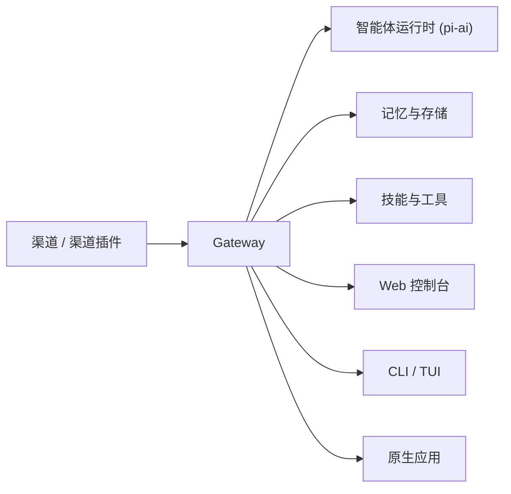

<p align="center">
  
</p>

<p align="center">
  <strong>你的 AI 灵魂伴侣 — 聊天、协作、创造</strong><br>
  自托管 AI 智能体网关，支持 WhatsApp、Telegram、Discord、Slack、iMessage 等 30+ 渠道。<br>
  一个网关连接多渠道，兼顾数据掌控、路由能力与可扩展性。
</p>

<p align="center">
  <a href="https://github.com/NJX-njx/opensoul/actions/workflows/ci.yml"></a>
  <a href="https://github.com/NJX-njx/opensoul/blob/main/LICENSE"></a>
  = 22">
  
  <a href="https://github.com/NJX-njx/opensoul/stargazers"></a>
</p>

<p align="center">
  <a href="#项目简介">项目简介</a> •
  <a href="#最近进展">最近进展</a> •
  <a href="#功能概览">功能概览</a> •
  <a href="#架构">架构</a> •
  <a href="#仓库结构">仓库结构</a> •
  <a href="#技术栈">技术栈</a> •
  <a href="#快速开始">快速开始</a> •
  <a href="#配置说明">配置说明</a> •
  <a href="#开发工作流">开发工作流</a> •
  <a href="#测试">测试</a> •
  <a href="#扩展开发">扩展开发</a> •
  <a href="#故障排查">故障排查</a> •
  <a href="#文档">文档</a>
</p>

---

## 项目简介

OpenSoul 是一个**自托管 AI 智能体网关**。你只需要运行一个网关进程，就可以在 WhatsApp、Telegram、Discord、Slack、iMessage 等多个渠道中使用同一个 AI 智能体。

它采用**本地优先控制平面**：将渠道适配层统一接入一个运行时，由你掌控模型路由、长期记忆、工具调用与安全边界。

## 最近进展

基于 [CHANGELOG](CHANGELOG.md) 的近期更新：

- Onboarding 与 Control UI 的国际化覆盖更完整。
- Windows 桌面端交互细节与连接稳定性提升。
- 网关连接与健康检查韧性增强。
- 扩展插件版本节奏与核心发布保持一致。

## 功能概览

### 🌐 30+ 渠道

| 类别       | 渠道                                                                 |
| ---------- | -------------------------------------------------------------------- |
| 即时通讯   | WhatsApp · Telegram · Signal · iMessage · Matrix · Mattermost · Zalo |
| 协作平台   | Slack · Discord · Microsoft Teams · 飞书 (Lark) · LINE               |
| Web + API  | Web 控制台 · WebChat · REST API · WebSocket                          |
| 语音与媒体 | 语音通话 · 音频 · 图片 · 文档                                        |

### 🧠 智能体运行时

- 多模型路由（OpenAI、Anthropic、Gemini、Bedrock、Ollama、MiniMax、OpenRouter 等）
- 按发送者/工作区隔离会话
- 基于向量检索的长期记忆
- 工具执行、沙箱与插件扩展机制

### 🛠️ 技能与工具

- [skills/](skills/) 提供 50+ 内置技能
- 支持 GitHub、Notion、Obsidian、Canvas、tmux、浏览器自动化等集成
- 提供公开插件 SDK，可扩展渠道、工具、Hook、Provider

### 📱 跨平台客户端

- macOS、iOS、Android、Windows 原生应用
- Web Control UI + CLI/TUI 工作流

## 架构


```mermaid
flowchart LR
  A["渠道 / 渠道插件"] --> B["Gateway"]
  B --> C["智能体运行时 (pi-ai)"]
  B --> D["记忆与存储"]
  B --> E["技能与工具"]
  B --> F["Web 控制台"]
  B --> G["CLI / TUI"]
  B --> H["原生应用"]
```

### 核心模块

| 模块          | 路径                 | 职责说明                         |
| ------------- | -------------------- | -------------------------------- |
| Gateway       | src/gateway          | HTTP/WS 服务、编排、sidecar 管理 |
| Agent Runtime | src/agents           | 会话执行、工具注入、运行时集成   |
| Routing       | src/routing          | 消息到智能体/会话的路由解析      |
| Plugins       | src/plugins          | 插件发现、加载、注册与运行时 API |
| Channels      | src/_ + extensions/_ | 渠道适配器与协议集成             |
| Memory        | src/memory           | 长期记忆与存储                   |
| Web UI        | ui/                  | 控制台前端（Lit + Vite）         |
| Apps          | apps/                | 原生移动/桌面客户端              |

## 仓库结构

```text
src/           核心网关、运行时、路由、配置、插件
extensions/    外部渠道/Provider/Hook 扩展
ui/            Web 控制台资源与前端应用
skills/        内置技能
docs/          用户与参考文档
apps/          原生客户端（Android/iOS/macOS/Windows）
scripts/       构建、发布、测试与工具脚本
```

## 技术栈

| 层级        | 版本                         |
| ----------- | ---------------------------- |
| Node.js     | >= 22.12.0                   |
| pnpm        | 10.23.0                      |
| TypeScript  | 5.9.3                        |
| Web UI      | Lit 3.3.2 + Vite             |
| API Server  | Hono 4.11.10 / Express 5.2.1 |
| Testing     | Vitest 4.0.18                |
| Lint/Format | Oxlint 1.43.0 + Oxfmt 0.28.0 |

## 快速开始

### 前置要求

- Node.js >= 22
- pnpm

### 安装

```bash
git clone https://github.com/NJX-njx/opensoul.git
cd opensoul
pnpm install
pnpm build
```

### 启动网关（开发模式）

```bash
# 跳过需要外部凭证的渠道
export OPENSOUL_SKIP_CHANNELS=1
export OPENSOUL_GATEWAY_TOKEN=dev-token
pnpm gateway:dev
```

### Windows（PowerShell）启动

```powershell
$env:OPENSOUL_SKIP_CHANNELS = "1"; $env:OPENSOUL_GATEWAY_TOKEN = "dev-token"; node scripts/run-node.mjs --dev gateway
```

### 生产运行

```bash
opensoul onboard
opensoul gateway run
```

## 配置说明

### 环境变量模板

可放在 `.env` 或 `~/.opensoul/.env`：

```bash
OPENAI_API_KEY=
ANTHROPIC_API_KEY=
OPENROUTER_API_KEY=
GEMINI_API_KEY=
MINIMAX_API_KEY=
OPENCODE_API_KEY=
ZAI_API_KEY=
OPENSOUL_GATEWAY_TOKEN=
```

加载顺序与优先级见 [Environment](docs/help/environment.md)。

### 关键说明

- 网关启动必须有 `OPENSOUL_GATEWAY_TOKEN`（或 `gateway.auth.token`）。
- 本地开发建议默认使用 `OPENSOUL_SKIP_CHANNELS=1`。
- 配置支持 JSON5、include 与 `${ENV}` 变量替换。

## 开发工作流

### 常用命令

```bash
pnpm install
pnpm build
pnpm dev
pnpm gateway:dev
pnpm check
pnpm test
```

### UI 改动流程

修改 `ui/` 后：

1. 执行 `pnpm ui:build`
2. 重启网关，刷新 Control UI 静态资源

### 质量门禁

- `pnpm check` = 类型检查 + lint + 格式检查
- `pnpm check:loc` 使用仓库阈值：`--max 2000 --max-function 150`

## 测试

- 主入口：`pnpm test`
- 关键配置：`vitest.config.ts`、`vitest.e2e.config.ts`、`vitest.gateway.config.ts`、`vitest.extensions.config.ts`、`vitest.live.config.ts`
- Docker / e2e 套件位于 `scripts/e2e/` 与 `test:docker:*` 脚本

## 扩展开发

- 扩展目录：`extensions/<name>/`
- 外部扩展请使用 `opensoul/plugin-sdk` 作为公开 API
- 不要从外部扩展直接导入内部 `src/*` 模块
- 通常包含 `opensoul.plugin.json` 与 `index.ts`

## 故障排查

| 现象                   | 常见原因                  | 处理方式                                              |
| ---------------------- | ------------------------- | ----------------------------------------------------- |
| 网关启动后立即退出     | 缺少 gateway token        | 设置 `OPENSOUL_GATEWAY_TOKEN` 或 `gateway.auth.token` |
| 开发模式启动渠道失败   | 缺少外部渠道凭证          | 本地开发使用 `OPENSOUL_SKIP_CHANNELS=1`               |
| 端口占用               | 端口已被其他进程占用      | 修改 `gateway.port` 或运行 `pnpm test:force` 清理     |
| 服务模式读不到 API Key | 守护进程未继承 shell 环境 | 将密钥写入 `~/.opensoul/.env` 或开启 `env.shellEnv`   |

## 文档

- [入门指南](docs/start/)
- [网关配置](docs/gateway/configuration.md)
- [渠道](docs/channels/)
- [技能与工具](docs/tools/)
- [模型提供商](docs/concepts/model-providers.md)
- [Web 控制台](docs/web/control-ui.md)

## API 参考

- [Gateway RPC](docs/reference/rpc.md)
- [参考索引](docs/reference/)

## 贡献

- [贡献指南](CONTRIBUTING.md)
- [行为准则](CODE_OF_CONDUCT.md)
- 维护者：[NJX-njx](https://github.com/NJX-njx)
- 贡献者：[GitHub Contributors](https://github.com/NJX-njx/opensoul/graphs/contributors)

## 许可证

[MIT License](LICENSE) — 详见 [LICENSE](LICENSE)。基于 [OpenClaw](https://github.com/nicepkg/openclaw)（MIT）构建。

---

<p align="center">
  如果 OpenSoul 对你有帮助，欢迎在 GitHub 点亮 ⭐。
</p>
