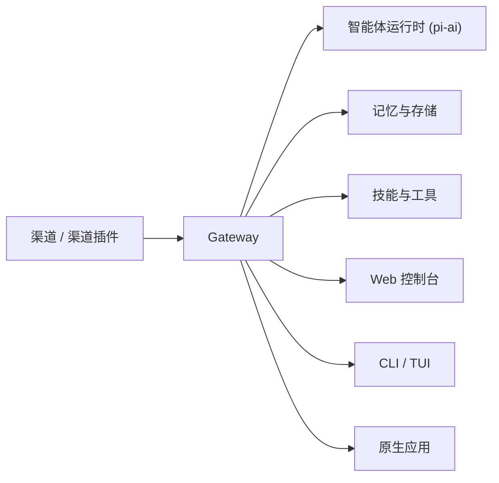

<p align="center">
  
</p>

<p align="center">
  <strong>你的 AI 灵魂伴侣 — 聊天、协作、创造</strong><br>
  自托管 AI 智能体网关，支持 WhatsApp、Telegram、Discord、Slack、iMessage 等 30+ 渠道。<br>
  一个网关连接多渠道，兼顾数据掌控、路由能力与可扩展性。
</p>

<p align="center">
  <a href="https://github.com/NJX-njx/opensoul/actions/workflows/ci.yml"></a>
  <a href="https://github.com/NJX-njx/opensoul/blob/main/LICENSE"></a>
  = 22">
  
  <a href="https://github.com/NJX-njx/opensoul/stargazers"></a>
</p>

<p align="center">
  <a href="#项目简介">项目简介</a> •
  <a href="#最近进展">最近进展</a> •
  <a href="#快速开始">快速开始</a> •
  <a href="#配置说明">配置说明</a> •
  <a href="#开发工作流">开发工作流</a> •
  <a href="#架构">架构</a> •
  <a href="#故障排查">故障排查</a> •
  <a href="#文档">文档</a> •
  <a href="ROADMAP.md">路线图</a>
</p>

---

## 项目简介

OpenSoul 是一个**自托管 AI 智能体网关**。你只需要运行一个网关进程，就可以在 WhatsApp、Telegram、Discord、Slack、iMessage 等多个渠道中使用同一个 AI 智能体。

它采用**本地优先控制平面**：将渠道适配层统一接入一个运行时，由你掌控模型路由、长期记忆、工具调用与安全边界。项目同时包含 Gateway、Web Control UI、CLI/TUI 工作流和原生客户端。

## 最近进展

基于 [CHANGELOG](CHANGELOG.md) 的近期更新：

### 最新维护更新（2026-03-09）

- **安装与发布稳定性**：`install-smoke` 固定到 Node 22，公开安装脚本统一到 `opensoul.ai`，并为 Docker 安装冒烟链路补充重试与超时控制。
- **CLI 与打包**：发布目标切换到公开 npm，新增友好的 Node 版本检查，补充 `opensoul --help` 环境变量说明，并改进插件短名解析。
- **运行时安全性**：加强 WebSocket 连接限制与保活、会话记录持久化、嵌入式运行器目录切换安全性，以及插件运行失败后的自动隔离。
- **文档与引导**：新增新手部署指南、Create Soulmate 指南，并改进 Control UI 的错误提示。

### 最近版本亮点（0.2.4）

- Control UI 支持会话记录加载与查看。
- 新增 Create Soulmate 弹窗，工作区管理流程更顺畅。
- WebSocket 断线后的自动重连更稳定。
- 引导流程、MiniMax 支持和 CLI 开发默认值进一步完善。

## 快速开始

### 前置要求

- Node.js >= 22.12.0
- pnpm >= 10

### 从源码安装

```bash
git clone https://github.com/NJX-njx/opensoul.git
cd opensoul
pnpm install
pnpm build
```

### 本地开发配置

```bash
# macOS / Linux
export OPENSOUL_SKIP_CHANNELS=1
export OPENSOUL_GATEWAY_TOKEN=dev-token
# 可选：至少配置一个模型提供商密钥
export OPENAI_API_KEY=your-api-key
```

### 本地启动

```bash
pnpm gateway:dev
```

### Windows（PowerShell）启动

```powershell
$env:OPENSOUL_SKIP_CHANNELS = "1"
$env:OPENSOUL_GATEWAY_TOKEN = "dev-token"
$env:OPENAI_API_KEY = "your-api-key"
node scripts/run-node.mjs --dev gateway
```

### 通过 CLI 安装并运行

```bash
npm install -g opensoul@latest
opensoul onboard
opensoul gateway run
```

模型密钥和 Provider 配置见 [模型配置指南](docs/guides/model-setup.md)。完整部署步骤见 [新手部署指南](docs/start/deployment-beginner.md)。

## 配置说明

共享配置建议放在 `.env` 或 `~/.opensoul/.env`：

```bash
OPENAI_API_KEY=
ANTHROPIC_API_KEY=
OPENROUTER_API_KEY=
GEMINI_API_KEY=
MINIMAX_API_KEY=
OPENSOUL_GATEWAY_TOKEN=
```

- 网关启动必须有 `OPENSOUL_GATEWAY_TOKEN`（或 `gateway.auth.token`）。
- 本地开发建议优先使用 `OPENSOUL_SKIP_CHANNELS=1`。
- 配置支持 JSON5、include 与 `${ENV}` 变量替换。加载顺序与优先级见 [Environment](docs/help/environment.md)。

## 开发工作流

```bash
pnpm install
pnpm build
pnpm dev
pnpm gateway:dev
pnpm check
pnpm test
```

- 修改 `ui/` 后先执行 `pnpm ui:build`，然后重启网关。
- `pnpm check` = 类型检查 + lint + 格式检查。
- `pnpm check:loc` 使用仓库阈值：`--max 2000 --max-function 150`。

## 架构


```mermaid
flowchart LR
  A["渠道 / 渠道插件"] --> B["Gateway"]
  B --> C["智能体运行时 (pi-ai)"]
  B --> D["记忆与存储"]
  B --> E["技能与工具"]
  B --> F["Web 控制台"]
  B --> G["CLI / TUI"]
  B --> H["原生应用"]
```

### 核心模块

| 模块          | 路径                                   | 职责说明                         |
| ------------- | -------------------------------------- | -------------------------------- |
| Gateway       | `src/gateway`                          | HTTP/WS 服务、编排、sidecar 管理 |
| Agent Runtime | `src/agents`                           | 会话执行、工具注入、运行时集成   |
| Routing       | `src/routing`                          | 消息到智能体/会话的路由解析      |
| 插件与渠道    | `src/plugins`、`src/_`、`extensions/_` | 插件加载、渠道适配与协议集成     |
| Memory        | `src/memory`                           | 长期记忆与存储                   |
| UI & Apps     | `ui/`、`apps/`                         | Web 控制台与原生客户端           |

### 仓库结构

```text
src/           核心网关、运行时、路由、配置、插件
extensions/    外部渠道/Provider/Hook 扩展
ui/            Web 控制台资源与前端应用
skills/        内置技能
docs/          用户与参考文档
apps/          原生客户端
scripts/       构建、发布、测试与工具脚本
```

### 技术栈

- 运行时：Node.js 22+、TypeScript 5.9、pnpm 10
- Web UI：Lit 3 + Vite
- API：Hono + Express
- 测试与质量：Vitest、Oxlint、Oxfmt

## 测试

- 主入口：`pnpm test`
- 关键配置：`vitest.config.ts`、`vitest.e2e.config.ts`、`vitest.gateway.config.ts`、`vitest.extensions.config.ts`、`vitest.live.config.ts`
- Docker / e2e 套件位于 `scripts/e2e/` 与 `test:docker:*`

## 扩展开发

- 扩展目录：`extensions/<name>/`
- 外部扩展请使用 `opensoul/plugin-sdk` 作为公开 API
- 不要从外部扩展直接导入内部 `src/*` 模块
- 通常包含 `opensoul.plugin.json` 与 `index.ts`

## 故障排查

| 现象                   | 常见原因                  | 处理方式                                              |
| ---------------------- | ------------------------- | ----------------------------------------------------- |
| 网关启动后立即退出     | 缺少 gateway token        | 设置 `OPENSOUL_GATEWAY_TOKEN` 或 `gateway.auth.token` |
| 开发模式启动渠道失败   | 缺少外部渠道凭证          | 本地开发使用 `OPENSOUL_SKIP_CHANNELS=1`               |
| 端口占用               | 端口已被其他进程占用      | 修改 `gateway.port` 或运行 `pnpm test:force` 清理     |
| 服务模式读不到 API Key | 守护进程未继承 shell 环境 | 将密钥写入 `~/.opensoul/.env` 或开启 `env.shellEnv`   |

## 文档

- [入门指南](docs/start/)
- [模型配置指南](docs/guides/model-setup.md)
- [新手部署指南](docs/start/deployment-beginner.md)
- [网关配置](docs/gateway/configuration.md)
- [渠道](docs/channels/)
- [技能与工具](docs/tools/)
- [参考索引](docs/reference/)
- [**Wiki**](https://github.com/NJX-njx/opensoul/wiki) — 项目知识库（英文）

## 路线图

查看 [ROADMAP.md](ROADMAP.md) 了解计划功能、当前优先级和已发布的里程碑。

## 贡献

- [贡献指南](CONTRIBUTING.md)
- [行为准则](CODE_OF_CONDUCT.md)
- 维护者：[NJX-njx](https://github.com/NJX-njx)
- 贡献者：[GitHub Contributors](https://github.com/NJX-njx/opensoul/graphs/contributors)

## 许可证

[MIT License](LICENSE) — 详见 [LICENSE](LICENSE)。基于 [OpenClaw](https://github.com/nicepkg/openclaw)（MIT）构建。

---

<p align="center">
  如果 OpenSoul 对你有帮助，欢迎在 GitHub 点亮 ⭐。
</p>
