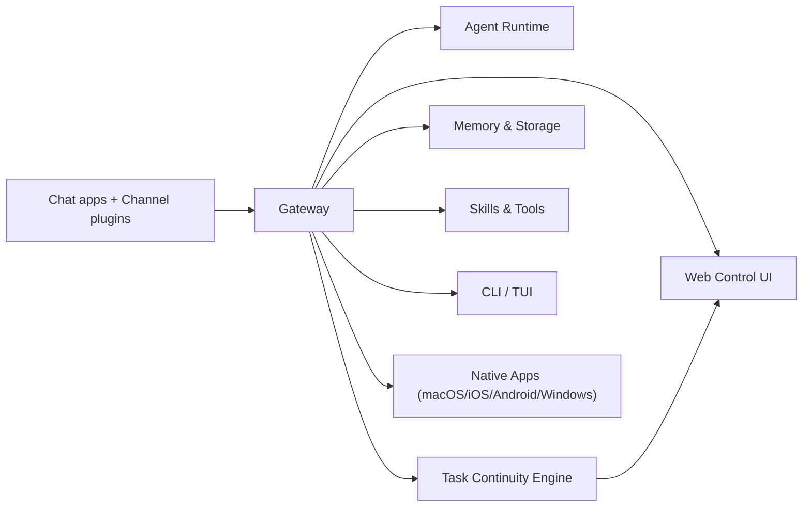

# OpenSoul

<p align="center">
    
    
</p>

<p align="center">
  <strong>One agent, many surfaces, one continuous task life.</strong><br />
  Self-hosted AI agent runtime for cross-surface task continuity across chat apps, Control UI, Canvas, cron, and paired devices.<br />
  Start in a DM, hand off into the browser, keep commitments and event history visible, and let the same task continue running.
</p>

<Columns>
  <Card title="Get Started" href="/start/getting-started" icon="rocket">
    Install OpenSoul and bring up the Gateway in minutes.
  </Card>
  <Card title="Run the Wizard" href="/start/wizard" icon="sparkles">
    Guided setup with `opensoul onboard` and pairing flows.
  </Card>
  <Card title="Open the Control UI" href="/web/control-ui" icon="layout-dashboard">
    Launch the browser cockpit for chat, continuity, config, and sessions.
  </Card>
</Columns>

## What is OpenSoul?

OpenSoul is a **self-hosted AI agent runtime for cross-surface task continuity**. You run a single Gateway process on your own machine (or a server), and one agent can keep the same task alive as work moves across WhatsApp, Telegram, Discord, Slack, the Web Control UI, Canvas, cron, and paired devices.

**Who is it for?** Anyone who wants an agent that can stay on the same task across surfaces — chat, browser, device, automation, and follow-up — without giving up control of their data or relying on a hosted control plane.

**What makes it different?**

- **Cross-surface task continuity**: one agent, many surfaces, one task state with commitments, events, and handoff history
- **Self-hosted**: runs on your hardware, your rules — no hosted control plane required
- **Multi-channel transport**: one Gateway serves WhatsApp, Telegram, Discord, Slack, and 30+ channels simultaneously
- **Agent-native**: built for AI agents with tool use, sessions, long-term memory, and multi-agent routing
- **Extensible**: plugin SDK for custom channels, tools, hooks, and providers
- **Cross-platform**: native apps for macOS, iOS, Android, Windows plus Web Control UI
- **Open source**: MIT licensed, community-driven

**What do you need?** Node 22+, an API key (OpenAI, Anthropic, Gemini, etc.), and 5 minutes.

## How it works


```mermaid
flowchart LR
  A["Chat apps + Channel plugins"] --> B["Gateway"]
  B --> C["Agent Runtime"]
  B --> D["Task Continuity Engine"]
  B --> E["Memory & Storage"]
  B --> F["Skills & Tools"]
  B --> G["Web Control UI"]
  D --> G
  B --> H["CLI / TUI"]
  B --> I["Native Apps (macOS/iOS/Android/Windows)"]
```

The Gateway is the single source of truth for sessions, routing, channel connections, and task continuity state. It orchestrates agent execution, memory, tools, handoff policy, and all client interactions.

## Key capabilities

<Columns>
  <Card title="Task continuity" icon="route">
    Keep the same task alive across direct chat, Control UI, Canvas, cron, and subagents.
  </Card>
  <Card title="Multi-channel gateway" icon="network">
    WhatsApp, Telegram, Discord, Slack, and more are the transport layer into the same runtime.
  </Card>
  <Card title="Plugin channels" icon="plug">
    Add Mattermost and more with extension packages.
  </Card>
  <Card title="Multi-agent routing" icon="route">
    Isolated sessions per agent, workspace, or sender.
  </Card>
  <Card title="Visible operator rail" icon="monitor">
    The Control UI chat view shows status, commitments, event timeline, and surface handoffs.
  </Card>
  <Card title="Web Control UI" icon="monitor">
    Browser cockpit for chat, config, sessions, continuity, and nodes.
  </Card>
  <Card title="Mobile nodes" icon="smartphone">
    Pair iOS and Android nodes with Canvas support.
  </Card>
</Columns>

## Quick start

<Steps>
  <Step title="Install OpenSoul">
    ```bash
    npm install -g opensoul@latest
    ```
  </Step>
  <Step title="Onboard and install the service">
    ```bash
    opensoul onboard --install-daemon
    ```
  </Step>
  <Step title="Pair WhatsApp and start the Gateway">
    ```bash
    opensoul channels login
    opensoul gateway --port 18789
    ```
  </Step>
</Steps>

Need the full install and dev setup? See [Quick start](/start/quickstart).

## Dashboard

Open the browser Control UI after the Gateway starts.

- Local default: [http://127.0.0.1:18789/](http://127.0.0.1:18789/)
- Remote access: [Web surfaces](/web) and [Tailscale](/gateway/tailscale)
- The chat page is now the main continuity surface: the right rail shows the current task, commitments, event timeline, and handoff track for the active session.

## Configuration (optional)

Config lives at `~/.opensoul/opensoul.json`.

- If you **do nothing**, OpenSoul uses the bundled Pi binary in RPC mode with per-sender sessions.
- If you want to lock it down, start with `channels.whatsapp.allowFrom` and (for groups) mention rules.

Example:

```json5
{
  channels: {
    whatsapp: {
      allowFrom: ["+15555550123"],
      groups: { "*": { requireMention: true } },
    },
  },
  messages: { groupChat: { mentionPatterns: ["@opensoul"] } },
}
```

## Start here

<Columns>
  <Card title="Docs hubs" href="/start/hubs" icon="book-open">
    All docs and guides, organized by use case.
  </Card>
  <Card title="Configuration" href="/gateway/configuration" icon="settings">
    Core Gateway settings, tokens, and provider config.
  </Card>
  <Card title="Remote access" href="/gateway/remote" icon="globe">
    SSH and tailnet access patterns.
  </Card>
  <Card title="Channels" href="/channels/telegram" icon="message-square">
    Channel-specific setup for WhatsApp, Telegram, Discord, and more.
  </Card>
  <Card title="Nodes" href="/nodes" icon="smartphone">
    iOS and Android nodes with pairing and Canvas.
  </Card>
  <Card title="Help" href="/help" icon="life-buoy">
    Common fixes and troubleshooting entry point.
  </Card>
</Columns>

## Learn more

<Columns>
  <Card title="Full feature list" href="/concepts/features" icon="list">
    Task continuity, channels, routing, and operator surfaces.
  </Card>
  <Card title="Multi-agent routing" href="/concepts/multi-agent" icon="route">
    Workspace isolation and per-agent sessions.
  </Card>
  <Card title="Security" href="/gateway/security" icon="shield">
    Tokens, allowlists, and safety controls.
  </Card>
  <Card title="Troubleshooting" href="/gateway/troubleshooting" icon="wrench">
    Gateway diagnostics and common errors.
  </Card>
  <Card title="About and credits" href="/reference/credits" icon="info">
    Project origins, contributors, and license.
  </Card>
</Columns>
